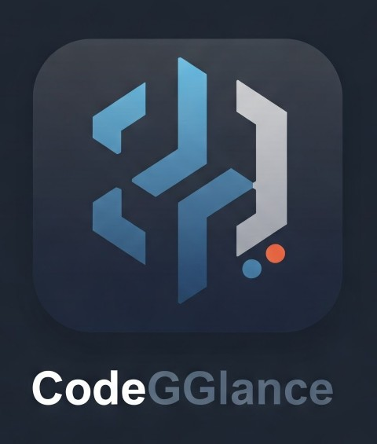

# CodeGGlance

## Professional Code Review & Translation Tool




https://github.com/user-attachments/assets/7f062305-a1cc-48d0-80bb-cfb9abae0c9b


CodeGGlance is a powerful web application designed to streamline your development workflow by providing instant code reviews and seamless translation between programming languages. Our intuitive interface allows developers to quickly analyze code quality and convert between various programming languages with a single click.

## Features

### Comprehensive Code Review
- **Instant Analysis**: Get detailed feedback on your code within seconds
- **Quality Metrics**: Receive insights on code structure, potential bugs, and optimization opportunities
- **Best Practices**: Learn industry-standard coding practices through personalized recommendations

### Multilingual Code Translation
- **15+ Languages**: Support for all major programming languages including Python, JavaScript, Java, C#, and more
- **Syntax Preservation**: Maintain logical structure and intent during translation
- **Contextual Adaptation**: Intelligent adaptation to language-specific paradigms and features

### User-Friendly Interface
- **Clean Design**: Minimalist layout focused on code presentation
- **Responsive**: Works seamlessly across desktop and mobile devices
- **Shareable Results**: Easy export and sharing of code reviews and translations

## Getting Started

### Prerequisites
- Node.js (v14 or higher)
- npm or yarn

### Installation

1. Clone the repository:
```bash
git clone https://github.com/gautamaggarwaldev/GEN-AI-code-review-app.git
cd code-review
```

2. Install dependencies:
```bash
npm install
# or
yarn install
```

3. Configure environment variables:
```bash
cp .env.example .env
# Edit .env with your specific settings
```

4. Start the development server:
```bash
npm start
# or
yarn start
```

5. Access the application at `http://localhost:8080`

## Dependencies Required

**In Backend**
- express
- cors
- nodemon **(optional)**
- dotenv

**In Frontend**
- axios
- @tailwindcss/vite
- tailwindcss


## Usage

### Code Review

1. Paste your code into the editor
2. Click the "Get Code Review" button
3. Review the detailed analysis and recommendations

### Code Translation

1. Paste your code into the editor
2. Select your target language from the dropdown
3. Click the "Translate Code" button
4. Copy the translated code for immediate use

## GEN AI API KEY

- Visit this website for api key = [GoogleAIStudio](https://aistudio.google.com/)

```javascript
const { GoogleGenerativeAI } = require("@google/generative-ai");

const genAI = new GoogleGenerativeAI("YOUR_API_KEY");
const model = genAI.getGenerativeModel({ model: "gemini-2.0-flash" });

const prompt = "Explain how AI works";

const result = await model.generateContent(prompt);
console.log(result.response.text());
```

## API Integration

CodeGGlance offers a RESTful API for integration with your development tools:

```javascript
// Example API call
const response = await axios.post("https://localhoast:1111/ai/get-review", {
  code: yourCode,
  translatedInto: ["c++", "java"],
});
```

## Setup Frontend

**React App**
```
npm create vite@latest
```

**Choose React and Javascript**

```
npm install
npm run dev
```

## Contributing

We welcome contributions from the community! Please read our [Contributing Guidelines](CONTRIBUTING.md) for details on how to submit pull requests, report issues, and join our development process.

## License

This project is licensed under the MIT License - see the [LICENSE](LICENSE) file for details.

## Acknowledgments

- Thanks to all our contributors and users
- Special thanks to the open-source libraries that make this project possible

## Contact

- LinkedIn: [Sumit Diwakar]www.linkedin.com/in/sumit-diwakar-8036752b5)
- Email: sumitdiwakar476@gmail.com
- GitHub: [github.com/sumitdiwaka](https://github.com/sumitdiwaka)

---

© 2025 CodeGGlance. All rights reserved.
